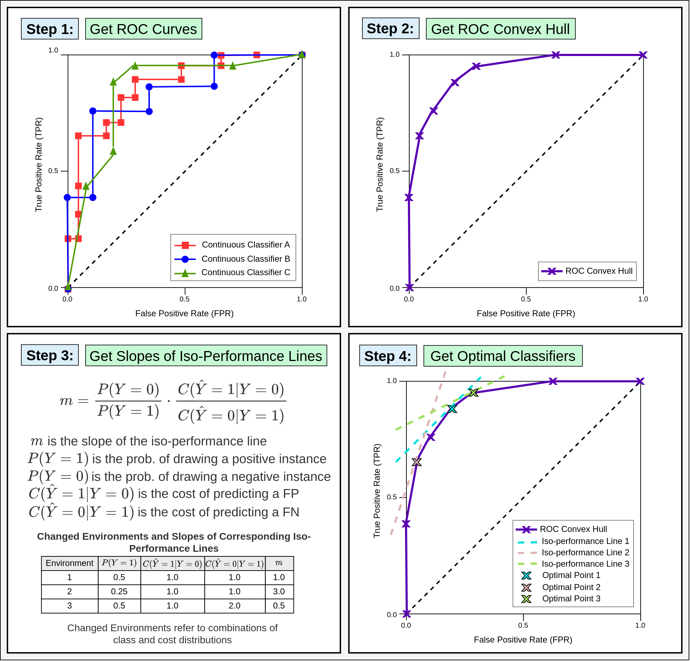
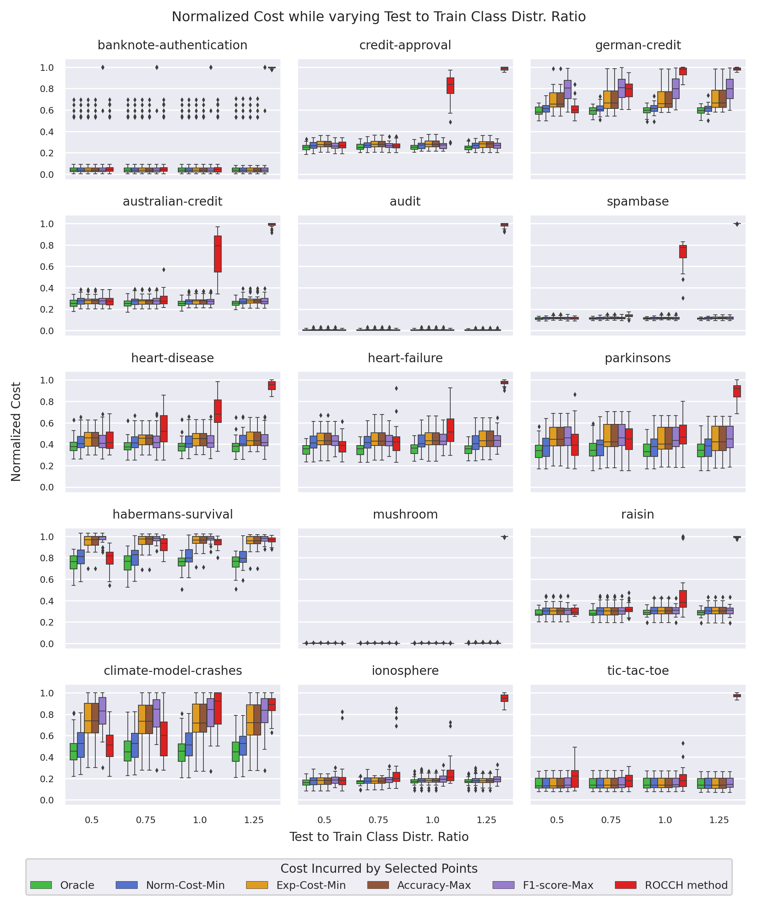
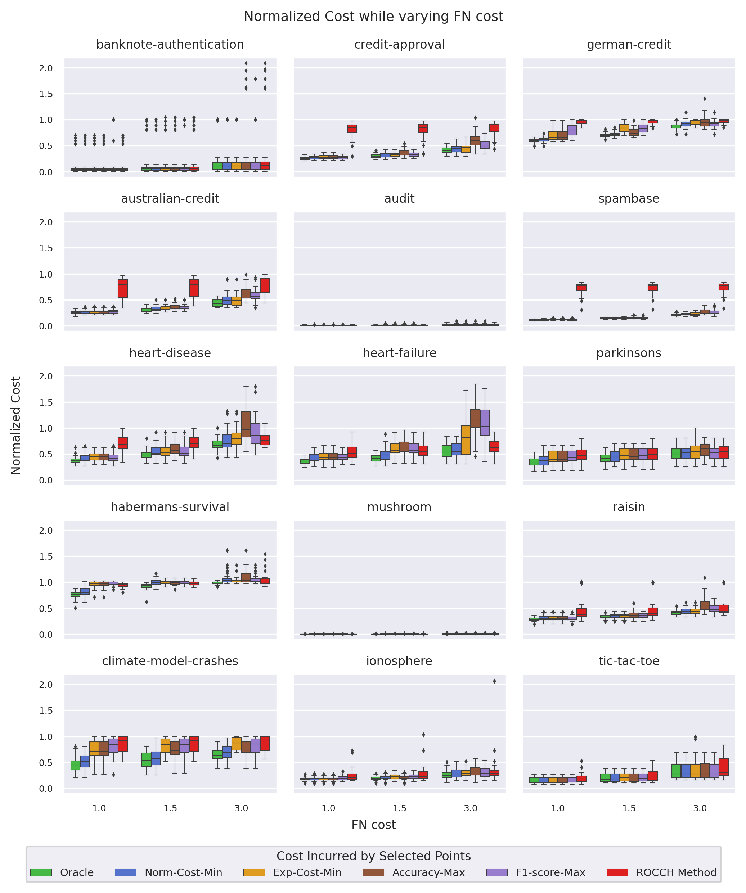

# Model Selection for Changed Environments

Code for model selection of ciscrete classifiers under class and cost distribution change, i.e., changed environments. Changed environments refer to circumstances when the relative frequency of positives and negatives, and mislabeling costs of making false positive and false negative errors of the test data is different from that of the training data. Expected cost and normalized (expected) cost are used to evaluate performance of selected discrete classifiers on changed environment test data.

## Candidate Approaches
 
Discrete classifiers on the ROC convex hull are selected based on the following approahces:
 
* `Norm-Cost-Min`: This appraoch selects discrete classifier that minimizes normalized cost on validation data, where probability of making mistakes on positives and negatives on the validation set are weighted by false positive and false negative misclassification costs of test data.
* `Exp-Cost-Min`:  This appraoch selects discrete classifier that minimizes normalized cost on validation data, where probability of making mistakes on positives and negatives on the validation set are weighted by relative frequency of positives and negatives, and false positive and false negative misclassification costs of test data.
* `Accuracy-Max`: This appraoch selects discrete classifier that maximizes accuracy on the validation data.
* `F1-score-Max`: This appraoch selects discrete classifier that maximizes F1-score on the validation data
* `ROCCH Method`: This approach uses isometrics to select classifiers (Provost and Fawcett, 1997, 1998, 2001).


## Requirements

* Python 3
* `imbalanced_learn`
* `matplotlib`
* `numpy`
* `pandas`
* `requests`
* `scikit_learn`
* `scipy`
* `seaborn`
* `statsmodels`
* `tqdm`

## Overview

`rocchmethod` contains implementation of the `ROCCH Method`, and other relevant utilities, e.g., for calculating expected cost, constructing ROC curves and ROC convex hulls, etc.) `experiments` contains code for running our experiments. 




## Experiments


Our experiments can be reproduced by running the following code in a terminal:

```
cd experiments
python run.py
```


## Plotting Results

### Changed Class Distributions


### Changed Cost Distributions



## Authors

* Nahian Ahmed, <ahmedna@oregonstate.edu>
* Rebecca A. Hutchinson, <rah@oregonstate.edu>

## References

Foster Provost and Tom Fawcett. Analysis and visualization of classifier performance with nonuniform class and cost distributions. In Proceedings of AAAI-97 Workshop on AI Approaches to Fraud Detection & Risk Management, Pages 57–63, 1997. <https://www.aiinternational.org/Library/KDD/1997/kdd97-007.php>.

Foster Provost and Tom Fawcett. Robust classification systems for imprecise environments. In AAAI/IAAI, Pages 706–713, 1998
<https://dl.acm.org/doi/10.5555/295240.295794>.

Foster Provost and Tom Fawcett. Robust classification for imprecise environments. Machine Learning, 42 (3), Pages 203–231, 2001.
https://doi.org/10.1023/A:1007601015854.


## Acknowledgements

Funding information

## BibTex

ArXiv/OpenReview
