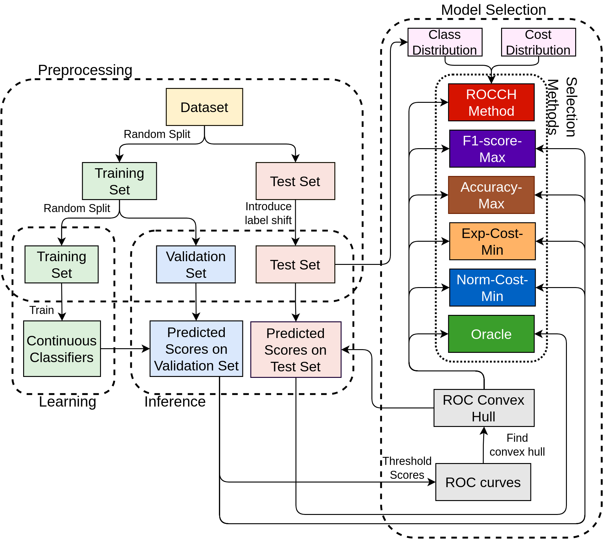

# Model Selection for Changed Environments

Code for model selection of discrete classifiers under class and cost distribution change, i.e., changed environments. Changed environments refer to circumstances when the relative frequency of positives and negatives, and mislabeling costs of making false positive and false negative errors of the test data is different from that of the training data. Normalized (expected) normalized cost is used to evaluate performance of selected discrete classifiers on changed environment test data.

## Candidate Approaches
 
Discrete classifiers on the ROC convex hull are selected based on the following approahces:

* `ROCCH Method`: This approach uses isometrics to select classifiers (Provost and Fawcett, 1997, 1998, 2001).
* `Norm-Cost-Min`: This appraoch selects discrete classifier that minimizes normalized cost on validation data, where probability of making mistakes on positives and negatives on the validation set are weighted by false positive and false negative misclassification costs of test data.
* `Exp-Cost-Min`:  This appraoch selects discrete classifier that minimizes normalized cost on validation data, where probability of making mistakes on positives and negatives on the validation set are weighted by relative frequency of positives and negatives, and false positive and false negative misclassification costs of test data.
* `Accuracy-Max`: This appraoch selects discrete classifier that maximizes accuracy on the validation data.
* `F1-score-Max`: This appraoch selects discrete classifier that maximizes F1-score on the validation data

Construcitng ROC convex hull and applying `ROCCH Method`:
<p align="center">
  
</p>


## Requirements

* Python 3
* `imbalanced_learn`
* `matplotlib`
* `numpy`
* `pandas`
* `requests`
* `scikit_learn`
* `scipy`
* `seaborn`
* `statsmodels`
* `tqdm`

## Overview

`rocchmethod` contains implementation of the `ROCCH Method`, and other relevant utilities, e.g., for calculating expected cost, constructing ROC curves and ROC convex hulls, etc.) `experiments` contains code for running all experiments. `experiments/UCI_MLR` contains code for running experiments on UCI Machine Learning Repository data sets, and `experiments/Synthetic` contains code for running experiments on synthetic data sets.

## Experiments

Our experiments can be reproduced by running the following code in a terminal:

```
cd experiments
python run.py
```

Experimental methodology of learning, inference, evaluation, and selection:
<p align="center">
  
</p>


### Changed Class Distributions

In these experimental settings, cost distributions are fixed and class distributions were changed. `Norm-Cost-Min` performs well on almost data sets. `Exp-Cost-Min` does not perform as well. `Accuracy-Max` and `F1-score-Max` do not perfom competitively because they can not factor class distributions of changed test environnments. `ROCCH Method` performs better when relative frequency of negatives is higher in the test set than the trainig set, but performs very poorly when the opposite happens.

Normalized cost while varying test to trian class distribution ratio:
<p align="center">
  
</p>


### Changed Cost Distributions

In these experimental settings, class distributions and are fixed and cost distributions were changed. `Accuracy-Max` and `F1-score-Max` do not perfom competitively. `ROCCh Method` seems to performn better on some dats sets when cost distributions are sekewd.

Normalized cost while varying false negative cost:
<p align="center">
  
</p>

## Authors

* Nahian Ahmed, <ahmedna@oregonstate.edu>
* Rebecca A. Hutchinson, <rah@oregonstate.edu>

## References

Foster J Provost, Tom Fawcett, et al. Analysis and visualization of classifier performance: comparison under imprecise class and cost distributions. In KDD, volume 97, pp. 43–48, 1997.
<https://dl.acm.org/doi/abs/10.5555/3001392.3001400>.

Foster Provost and Tom Fawcett. Robust classification systems for imprecise environments. In AAAI/IAAI, Pages 706–713, 199
<https://dl.acm.org/doi/10.5555/295240.295794>.

Foster Provost and Tom Fawcett. Robust classification for imprecise environments. Machine Learning, 42 (3), Pages 203–231, 2001.
https://doi.org/10.1023/A:1007601015854.


## Acknowledgements

Funding information

## BibTex

ArXiv/OpenReview
