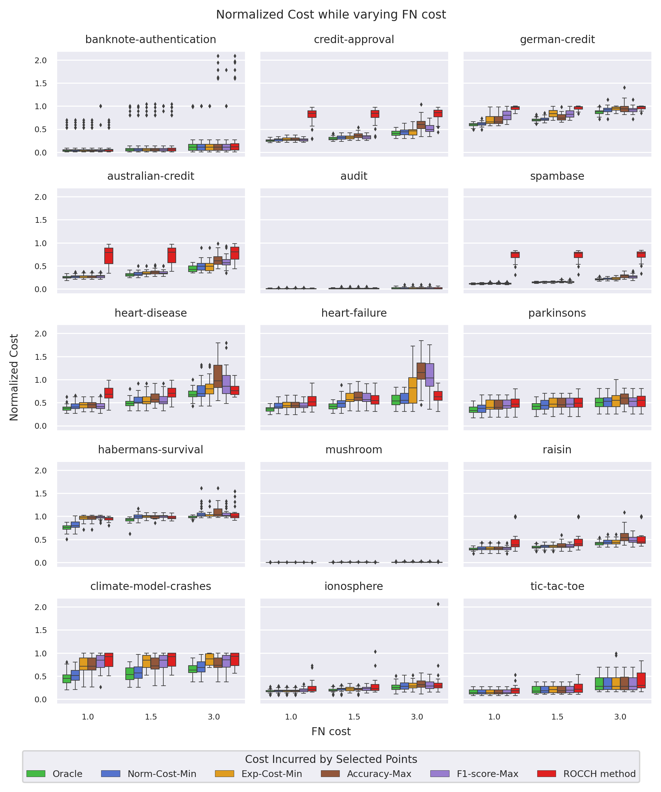

# Model Selection under Class and Cost Distribution Change

## Requirements

* Python 3
* `imbalanced_learn`
* `matplotlib`
* `numpy`
* `pandas`
* `requests`
* `scikit_learn`
* `scipy`
* `seaborn`
* `statsmodels`
* `tqdm`

## Overview

